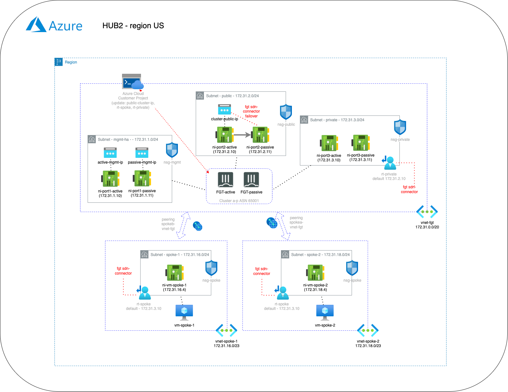

# Deployment of a FortiGate-VM (BYOL/PAYG) Cluster on the Azure with Terraform
## Introduction
### This topology is only recommended for using with FOS 7.0.5 and later, since FSO 7.0 3 ports only HA setup is supported.

This IaC is a part of a full deployment of a HUB and Spoke with 2 HUBs and 1 site. In particular, here we have the code to deploy one of the hubs in Azure.

This is a didactic example to showcase how a Transit VPC should be configured to achieve a non-trivial (full mesh) scenario.

## Requirements
* [Terraform](https://learn.hashicorp.com/terraform/getting-started/install.html) >= 0.12.0
* Terraform Provider AzureRM >= 2.24.0
* Terraform Provider Template >= 2.2.0
* Terraform Provider Random >= 3.1.0

## License
- The terms for the FortiGate PAYG or BYOL image in the Azure Marketplace needs to be accepted once before usage. This is done automatically during deployment via the Azure Portal. For the Azure CLI the commands below need to be run before the first deployment in a subscription.
  - BYOL
`az vm image terms accept --publisher fortinet --offer fortinet_fortigate-vm_v5 --plan fortinet_fg-vm`
  - PAYG
`az vm image terms accept --publisher fortinet --offer fortinet_fortigate-vm_v5 --plan fortinet_fg-vm_payg_2022`

## Deployment overview
Terraform deploys the following components:
   - Azure Virtual Network (vnet) with 3 subnets as hub vnet (subnets: mgmt-ha, public, private).
   - Two vnet as spokes peered with firewall vnet (vnet-spoke-1, vnet-spoke-2), route tables updated by Fortinet SDN-Connector.
   - Two FortiGate-VM (BYOL/PAYG) instances with four NICs in HA active/passive (default PAYG)
   - Firewalls rules to allow traffic E-W spokes, N-S spoke-public and E-W spoke sites connected with ADVPN.
   - IPSEC connections using ADVPN to site (there is a deployment in GCP as part of the full scenario outsite this particular script)
   - Two Ubuntu Client instance in spokes vnet subnets.
   - eBGP routing over the advpn tunnels.
   - 3 publics IPs:
      - 2 public IPs for fortigate units management
      - 1 cluster public IP for Internet access (cluster-public-ip, this IP is shared between cluster and updated by SDN Connector in case of failure)

## Deployment considerations:
      - Update variables in var1.tf with data from HUB1 deployment
      - You will be charged for this deployment

## Diagram solution



## Deployment
To deploy the FortiGate-VM to Azure:
1. Clone the repository.
2. Customize variables in the `terraform.tfvars.example` and `variables.tf` file as needed.  And rename `terraform.tfvars.example` to `terraform.tfvars`.
3. Initialize the providers and modules:
   ```sh
   $ cd XXXXX
   $ terraform init
    ```
4. Submit the Terraform plan:
   ```sh
   $ terraform plan
   ```
5. Verify output.
6. Confirm and apply the plan:
   ```sh
   $ terraform apply
   ```
7. If output is satisfactory, type `yes`.

Output will include the information necessary to log in to the FortiGate-VM instances:
```sh
Outputs:

FGT_Active_MGMT_Public_IP = <Active FGT Management Public IP>
FGT_Cluster_Public_IP = <Cluster Public IP for ADVPN>
FGT_Passive_MGMT_Public_IP = <Passive FGT Management Public IP>
FGT_Password = <FGT Password>
FGT_Username = <FGT admin>
TestVM_spoke-1-IP = <Spoke-1 test instance ip>
TestVM_spoke-2-IP = <Spoke-2 test instance ip>
advpn_ipsec-psk-ke = <random PSK generated to ADVPN for sites>
```

## Destroy the instance
To destroy the instance, use the command:
```sh
$ terraform destroy
```

# Support
This a personal repository with goal of testing and demo Fortinet solutions on the Cloud. No support is provided and must be used by your own responsability. Cloud Providers will charge for this deployments, please take it in count before proceed.

## License
Based on Fortinet repositories with original [License](https://github.com/fortinet/fortigate-terraform-deploy/blob/master/LICENSE) © Fortinet Technologies. All rights reserved.

