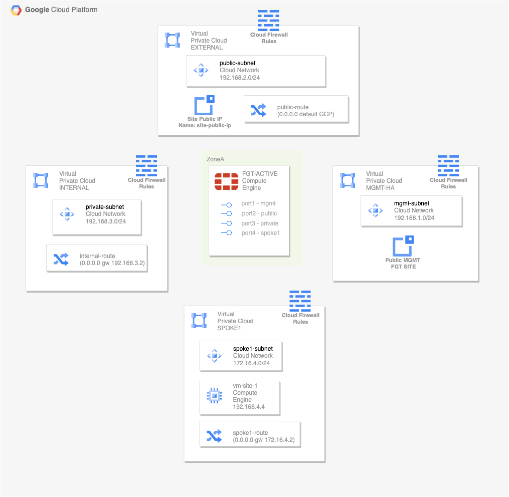

# Deployment of FortiGate-VM on the Google Cloud Platform (GCP)
## Introduction
This IaC is a part of a full deployment of a HUB and Spoke with 2 HUBs and 1 site. In particular, this is code for a deployment of a site in GCP connected to two HUBs.  

## Requirements
* [Terraform](https://learn.hashicorp.com/terraform/getting-started/install.html) >= 0.12.0
* Terraform Provider for Google Cloud Platform >=2.11.0
* Terraform Provider for Google Cloud Platform Beta >=2.13
* Terraform Provider for random 2.2.1
* Terraform Provider for template 2.1.2
* A [GCP OAuth2 access token](https://developers.google.com/identity/protocols/OAuth2)

## Deployment overview
Terraform deploys the following components:
   - A VPC MGMT and HA - port 1 FTG for management and ha
   - A VPC with one public subnet - port2 FTG
   - A VPC INTERNAL - port2 FTG
   - A VPC SPOKE1 - port4 FTG
   - Two FortiGate-VM (BYOL/PAYG) instances with five NICs
   - Firewall rules for allowing traffic to public interface from internal, spoke1 and spoke2, also between spokes.

## Deployment considerations:
      - Update variables in var1.tf with data from HUB1 and HUB2 deployment
      - You will be charged for this deployment

## Diagram solution



## Deployment
To deploy the FortiGate-VM to GCP:
1. Clone the repository.
2. Obtain a GCP OAuth2 token and input it in the vars.tf file.
3. Customize variables in the `vars.tf` file as needed.
4. Initialize the providers and modules:
   ```sh
   $ cd XXXXX
   $ terraform init
    ```
5. Submit the Terraform plan:
   ```sh
   $ terraform plan
   ```
6. Verify output.
7. Confirm and apply the plan:
   ```sh
   $ terraform apply
   ```
8. If output is satisfactory, type `yes`.

Output will include the information necessary to log in to the FortiGate-VM instances:
```sh
FortiGate-MGMT-URL = <https://XXX.XXX.XXX.XXX:adminport>
FortiGate-Password = <password here>
FortiGate-Username = admin
```

## Destroy the instance
To destroy the instance, use the command:
```sh
$ terraform destroy
```

# Support
This a personal repository with goal of testing and demo Fortinet solutions on the Cloud. No support is provided and must be used by your own responsability. Cloud Providers will charge for this deployments, please take it in count before proceed.

## License
Based on Fortinet repositories with original [License](https://github.com/fortinet/fortigate-terraform-deploy/blob/master/LICENSE) © Fortinet Technologies. All rights reserved.